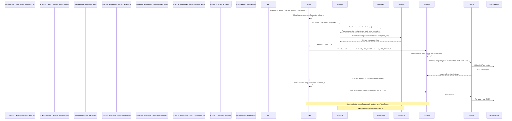

# RDP 集成计划

## 整体架构思路

我们将采用与 `test-rdp` 类似的架构：

1.  **前端 (`packages/frontend`):** 使用 `guacamole-common-js` 库在 `RemoteDesktopModal.vue` 组件中渲染 RDP 界面并处理用户输入。
2.  **后端 API (`packages/backend`):** 提供一个接口，根据连接 ID 从数据库获取连接信息，并生成一个加密的 Guacamole 连接令牌 (`token`)。
3.  **WebSocket 代理:** 需要一个服务来处理前端和 `guacd` 之间的 WebSocket 通信。我们将采用 `test-rdp` 中的 `guacamole-lite` 方案，但将其作为一个**独立的服务**运行，与主后端分开。
4.  **Guacamole Daemon (`guacd`):** 这是 Guacamole 的核心组件，需要单独运行，负责实际的 RDP 协议转换。

## 详细计划步骤

### 1. 后端 (`packages/backend`)

*   **创建 Guacamole 服务 (`guacamole.service.ts`):**
    *   在 `packages/backend/src/services/` 目录下创建新文件 `guacamole.service.ts`。
    *   实现一个 `generateConnectionToken` 方法：
        *   接收 `ConnectionInfo` 对象和加密密钥作为参数。
        *   将 `ConnectionInfo` 构造成 Guacamole 所需的 JSON 结构（包含 `type: 'rdp'`, `settings: {...}`）。
        *   使用 `crypto` 模块和 `AES-256-CBC` 算法，以及一个 32 字节的加密密钥（从配置加载）来加密这个 JSON 字符串。
        *   返回 Base64 编码后的加密令牌（格式需与 `guacamole-lite` 解密时兼容，参考 `test-rdp/backend/src/server.ts` 的 `encryptToken` 函数）。
*   **添加 API 端点 (`connections.controller.ts`, `connections.routes.ts`):**
    *   在 `ConnectionsController` 中添加一个新方法，例如 `getRdpToken`。
    *   添加一个新的路由，例如 `GET /api/connections/:id/rdp-token`，指向 `getRdpToken` 方法。
    *   `getRdpToken` 方法：
        *   从请求参数中获取 `id`。
        *   注入并使用 `ConnectionService` 根据 `id` 获取完整的 `ConnectionInfo`（包括主机、端口、用户名、密码等）。
        *   注入并使用新创建的 `GuacamoleService` 的 `generateConnectionToken` 方法生成令牌。
        *   将生成的令牌以 JSON 格式 (`{ token: "..." }`) 返回给前端。
*   **配置:**
    *   在后端配置中（例如通过环境变量 `.env` 或配置文件）定义 `GUACAMOLE_ENCRYPTION_KEY`。**这个密钥必须是 32 字节长**，并且需要与后面运行的 `guacamole-lite` 服务使用的密钥相同。
    *   确保后端能正确加载和使用这个密钥。
*   **依赖:**
    *   确保 `packages/backend/package.json` 中包含 `crypto` (Node.js 内置)。

### 2. 前端 (`packages/frontend`)

*   **`RemoteDesktopModal.vue`:**
    *   **Props:** 确认组件接收 `connection: ConnectionInfo` 作为 prop。
    *   **模板:** 在 `<template>` 中添加一个 `div` 用于显示 RDP 内容，并给它一个 `ref`，例如 `

`。确保这个容器能正确填充模态框区域。
    *   **脚本 (`<script setup>`):**
        *   导入 `ref`, `onMounted`, `onUnmounted`, `watch` 等 Vue API。
        *   导入 `Guacamole` from `guacamole-common-js`。
        *   导入 `apiClient` (或其他用于 API 请求的工具)。
        *   定义状态变量：`guacClient = ref<Guacamole.Client | null>(null)`, `connectionStatus = ref<'disconnected' | 'connecting' | 'connected' | 'error'>('disconnected')`, `statusMessage = ref('')` 等。
        *   定义 `rdpDisplayRef = ref<HTMLDivElement | null>(null)`。
        *   **连接逻辑 (例如 `connectRdp` 方法):**
            *   当模态框显示且 `props.connection` 有效时触发。
            *   设置状态为 `connecting`。
            *   调用后端 API `GET /api/connections/${props.connection.id}/rdp-token` 获取令牌。
            *   处理 API 错误。
            *   **获取 WebSocket URL:** 需要确定 `guacamole-lite` 服务的地址和端口 (例如 `ws://localhost:8081`)。这可以通过配置或从后端获取。
            *   构造完整的 WebSocket URL: `const tunnelUrl = \`ws://<GUAC_LITE_HOST>:<GUAC_LITE_PORT>/?token=\${encodeURIComponent(token)}\`;`
            *   创建 `Guacamole.WebSocketTunnel(tunnelUrl)`。
            *   创建 `Guacamole.Client(tunnel)`。
            *   将 `guacClient.value.getDisplay().getElement()` 添加到 `rdpDisplayRef.value` 中。
            *   设置 `onstatechange`, `onerror`, `oninstruction` 等事件处理器（参考 `test-rdp/frontend/src/App.vue`）。
            *   设置鼠标 (`Guacamole.Mouse`) 和键盘 (`Guacamole.Keyboard`) 事件监听器，并将事件发送给 `guacClient.value`。
            *   调用 `guacClient.value.connect()`。
        *   **断开连接逻辑 (例如 `disconnectRdp` 方法):**
            *   在 `closeModal` 函数中或 `onUnmounted` 钩子中调用。
            *   检查 `guacClient.value` 是否存在并已连接。
            *   调用 `guacClient.value.disconnect()`。
            *   清理 `rdpDisplayRef.value` 的内容。
            *   重置状态变量。
*   **依赖:**
    *   运行 `npm install guacamole-common-js` 或 `yarn add guacamole-common-js` 在 `packages/frontend` 目录下。
*   **类型定义:**
    *   检查 `packages/frontend/src/types/guacamole.d.ts` 是否存在且内容充分。如果不存在，需要创建它并添加必要的类型声明，或者至少在使用 `Guacamole` 对象时使用 `@ts-ignore` 或 `any` (不推荐)。

### 3. WebSocket 代理 (`guacamole-lite` 服务)

*   **独立运行:** 将 `test-rdp/backend` 的代码（主要是 `server.ts` 和 `package.json`）复制到一个新的目录，或者调整它以便可以独立运行。
*   **配置:**
    *   确保它使用的 `ENCRYPTION_KEY_STRING` 与 `packages/backend` 配置的 `GUACAMOLE_ENCRYPTION_KEY` **完全相同**。
    *   配置 `GUACD_HOST` 和 `GUACD_PORT` 指向你实际运行的 `guacd` 服务。
    *   配置 `GUAC_WS_PORT` (例如 `8081`)，前端将连接到这个端口。
    *   **移除 API 部分:** 这个独立的服务**不需要** `test-rdp/backend/server.ts` 中的 Express API (`/api/get-token`) 部分，因为它只负责 WebSocket 代理。主项目的后端会处理令牌生成。
*   **运行方式:** 使用 `node` 或 `pm2` 等工具运行这个 `guacamole-lite` 服务。

### 4. Guacamole Daemon (`guacd`)

*   你需要一个正在运行的 `guacd` 服务实例。这通常通过 Docker 镜像 (`guacamole/guacd`) 来部署。
*   确保 `guacamole-lite` 服务可以访问到 `guacd` 的主机和端口。

## 时序图

## 注意事项

*   **分步测试:** 按照你的要求，每完成一个主要步骤（例如后端 API、前端连接逻辑）后都应进行测试。
*   **密钥安全:** `GUACAMOLE_ENCRYPTION_KEY` 是敏感信息，应妥善保管，不要硬编码在代码中，建议使用环境变量或安全的配置管理方式。
*   **错误处理:** 在前后端代码中添加健壮的错误处理逻辑。
*   **依赖管理:** 确保所有必要的依赖都已正确安装。